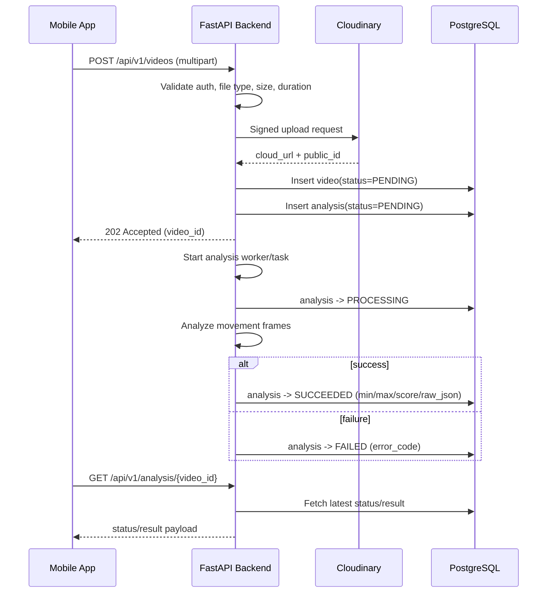

# Upload to Analysis Sequence (Phase 1.3)

```mermaid
sequenceDiagram
    participant M as Mobile App
    participant B as FastAPI Backend
    participant C as Cloudinary
    participant DB as PostgreSQL

    M->>B: POST /api/v1/videos (multipart)
    B->>B: Validate auth, file type, size, duration
    B->>C: Signed upload request
    C-->>B: cloud_url + public_id
    B->>DB: Insert video(status=PENDING)
    B->>DB: Insert analysis(status=PENDING)
    B-->>M: 202 Accepted (video_id)

    B->>B: Start analysis worker/task
    B->>DB: analysis -> PROCESSING
    B->>B: Analyze movement frames
    alt success
        B->>DB: analysis -> SUCCEEDED (min/max/score/raw_json)
    else failure
        B->>DB: analysis -> FAILED (error_code)
    end

    M->>B: GET /api/v1/analysis/{video_id}
    B->>DB: Fetch latest status/result
    B-->>M: status/result payload
```
